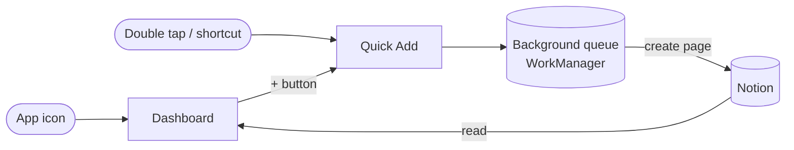

<p align="center">
  
</p>

<h1 align="center">Notion Expense</h1>

<p align="center">
  <strong>Record an expense in seconds. Keep your budget in Notion.</strong><br>
  An Android app that writes straight into the finance tracker you already have.
</p>

<p align="center">
  
  
  
  
</p>

<p align="center">
  <a href="#-getting-started">Getting started</a> ·
  <a href="#-double-tap-to-add-with-good-lock-registar">Double tap with RegiStar</a> ·
  <a href="#-troubleshooting">Troubleshooting</a>
</p>

---

Notion is a great place to **keep** a budget and a poor place to **enter** one.
Adding a row from your phone means opening Notion, finding the database, creating
a page and filling in four properties. That's enough friction that small expenses
never get recorded.

**Notion Expense cuts that down to a few taps.** Type the amount, confirm the
details, done. The app writes to Notion in the background, and it keeps working
when you're offline.

## ✨ Features

<table>
<tr>
<td width="50%" valign="top">

### ⚡ Quick Add
A floating card that opens over whatever you're doing.

- Five steps, one decision each:<br>
  `Amount → Description → Date → Account → Category`
- Numeric keypad with haptic feedback
- Accounts and categories loaded **live from Notion**
- Remembers your last account and category
- Works **offline**: the expense is queued and sent when you're back online

</td>
<td width="50%" valign="top">

### 📊 Dashboard
Opens when you tap the app icon.

- **Home**: monthly total, budget progress, key stats, a
  daily-spending chart, and breakdowns by category and account
- **Expenses**: every expense in the month, with a calendar,
  category/account filters and sorting by date or amount
- **Delete** an expense with a tap. It goes to the Notion trash,
  so you can still restore it
- **Light & Dark** theme, shared with Quick Add

</td>
</tr>
</table>

**Reliable sync.** Expenses are sent with WorkManager, which keeps working after
you close the app, after the system kills it and after a reboot. Temporary
failures are retried with exponential backoff. You get a notification **only**
when Notion has actually saved the expense, or when the send has failed for good.
Nothing shows up while a retry is still pending.

## 🧭 How it works

One app, one launcher icon, two entry points:



Notion stays the **source of truth**. The app never creates a database and never
changes your schema, views or properties. It only works with a structure you
already have:

```
Finance Tracker
├── Expenses     ← one new page per expense (and read by the Dashboard)
├── Accounts     ← read to fill the Account picker
├── Categories   ← read to fill the Category picker and the monthly budget
├── Incomes      (untouched)
└── Transfers    (untouched)
```

### Expected Notion schema

| Table | Property | Type | Notes |
|---|---|---|---|
| **Expenses** | *title* | Title | The description |
| | Amount | Number | |
| | Date | Date | |
| | Category | Relation → Categories | `select`, `multi_select` and `rich_text` also work |
| | Account | Relation → Accounts | |
| **Categories** | *title* | Title | Shown in the picker |
| | `Monthly Budget` | Number | *Optional.* The sum across all categories becomes the budget on Home |
| **Accounts** | *title* | Title | Shown in the picker |

Expenses property names are **configuration, not code**, so you can map them to
whatever your columns are called. The one exception is `Monthly Budget`, which
must be spelled exactly like that.

## 🚀 Getting started

### Prerequisites

- **Android Studio**, which bundles the JDK 17+ the build needs
- An Android phone running **Android 8.0 (API 26)** or later, with
  [USB debugging](https://developer.android.com/studio/debug/dev-options) enabled
- A Notion workspace with the tables described above

### 1. Clone the repository

```bash
git clone https://github.com/ArmyUser/NotionExpense.git
cd NotionExpense
```

### 2. Create a Notion integration

1. Go to **[notion.so/my-integrations](https://www.notion.so/my-integrations)** →
   **New integration** → type **Internal**.
2. Under **Capabilities**, enable:

   | Capability | Why the app needs it |
   |---|---|
   | ✅ Read content | Load accounts, categories and the Dashboard |
   | ✅ Insert content | Create a page for each new expense |
   | ✅ Update content | Move an expense to the trash from the Dashboard |

3. Copy the **Internal Integration Secret** (it starts with `ntn_`).

### 3. Give the integration access to your tables

In Notion, open your finance tracker and choose **⋯ → Connections → Connect to →
*your integration***. If Accounts and Categories are separate pages, do the same
for each of them.

> [!IMPORTANT]
> If you skip this step, Notion returns `404 object_not_found`, not a permission
> error. It's the most common setup mistake.

### 4. Configure your credentials

Credentials **never** go into the repository. They live in your personal Gradle
file, outside the project:

```bash
open -e ~/.gradle/gradle.properties     # macOS: creates or opens the file
```

Paste these keys and fill in your own values:

```properties
# --- Credentials -------------------------------------------------------
notionToken=ntn_xxxxxxxxxxxxxxxxxxxxxxxxxxxx

# --- Data source IDs (NOT database IDs; see below) ---------------------
notionDataSourceId=              # Expenses
notionCategoryDataSourceId=      # Categories
notionAccountsDataSourceId=      # Accounts

# --- Database ID (only used by the "Open in Notion" button) ------------
notionDatabaseId=

# --- Property names in your Expenses table -----------------------------
notionPropTitle=Expense
notionPropAmount=Amount
notionPropDate=Date
notionPropCategory=Category
notionPropAccount=Account
notionPropCategoryType=relation  # relation | select | multi_select | rich_text
```

<details>
<summary><strong>📋 What each key means and its default</strong></summary>

<br>

| Key | Required | Default | Description |
|---|:---:|---|---|
| `notionToken` | ✅ | — | Integration secret from step 2 |
| `notionDataSourceId` | ✅ | — | Data source of the **Expenses** table |
| `notionCategoryDataSourceId` | ✅* | — | Data source of **Categories** (*required when Category is a relation) |
| `notionAccountsDataSourceId` | ✅ | — | Data source of **Accounts** |
| `notionDatabaseId` | | — | ID of the database page, used by **Open in Notion** |
| `notionPropTitle` | | `Name` | Name of the title column |
| `notionPropAmount` | | `Amount` | Name of the amount column |
| `notionPropDate` | | `Date` | Name of the date column |
| `notionPropCategory` | | `Category` | Name of the category column |
| `notionPropAccount` | | `Account` | Name of the account column |
| `notionPropCategoryType` | | `select` | Type of the category column |

</details>

<details>
<summary><strong>🔎 How to find the database ID and data source IDs</strong></summary>

<br>

The app uses Notion's **data source** API (`Notion-Version: 2026-03-11`), so it
needs each table's **data source ID**, not its database ID.

**Database ID.** Open the database in your browser. It's the 32-character string
in the URL:

```
https://www.notion.so/your-workspace/Finance-Tracker-1a2b3c4d5e6f7a8b9c0d1e2f3a4b5c6d?v=...
                                                     └──────── database ID ────────┘
```

**Data source IDs.** List them with the database ID:

```bash
TOKEN=ntn_xxx
curl -s -H "Authorization: Bearer $TOKEN" -H "Notion-Version: 2026-03-11" \
     https://api.notion.com/v1/databases/<database-id> \
  | python3 -c "import sys,json;[print(d['id'],d.get('name')) for d in json.load(sys.stdin)['data_sources']]"
```

**Exact property names and types** (to fill in the `notionProp*` keys):

```bash
curl -s -H "Authorization: Bearer $TOKEN" -H "Notion-Version: 2026-03-11" \
     https://api.notion.com/v1/data_sources/<data-source-id> \
  | python3 -c "import sys,json;[print(k,v['type']) for k,v in json.load(sys.stdin)['properties'].items()]"
```

</details>

### 5. Build and install

Connect your phone over USB and run:

```bash
./gradlew :app:installRelease
```

This installs an optimised, non-debuggable build that starts faster. It's signed
with the debug key, so it's for installing on your own phone, not for publishing.
During development you can use `./gradlew :app:installDebug` instead.

> [!TIP]
> If Gradle can't find a JDK, point it to the one bundled with Android Studio:
> ```bash
> export JAVA_HOME="/Applications/Android Studio.app/Contents/jbr/Contents/Home"
> ```

### 6. Check the connection

Open the app → **Settings**. The **Notion** section should show
**Connection: Configured**. If it says *Not configured*, the keys weren't picked
up. Check `~/.gradle/gradle.properties` and rebuild.

> [!NOTE]
> Your credentials are compiled into the app at **build time**. Every time you
> change `gradle.properties`, run the install command again.

## 👆 Double tap to add with Good Lock RegiStar

The best way to use Notion Expense is to **not look for the icon at all**. On
Samsung Galaxy phones, you can open Quick Add with a **double tap on the back of
the phone**, like Back Tap on the iPhone.

### What you need

- A **Samsung Galaxy** phone with a recent version of One UI
- **Good Lock**, free from the Galaxy Store (it isn't available in every country)
- Notion Expense already installed (see [Getting started](#-getting-started))

### Setup

1. **Install Good Lock**
   Open the **Galaxy Store**, search for **Good Lock** and install it.

2. **Install the RegiStar module**
   Open Good Lock, find **RegiStar** in the module list and tap it to install.

3. **Turn on Back-Tap**
   Open **RegiStar** → **Back-Tap action** → turn the switch **on**.

4. **Assign the double tap**
   Tap **Double tap** and choose the action that opens an **app shortcut**.
   Then select **Notion Expense → Quick Add**.

5. **Try it**
   Go back to your home screen or any app and tap the back of the phone twice.
   The Quick Add card appears over whatever is on screen.

> [!TIP]
> RegiStar can also assign a **triple tap**. A handy setup:
> **double tap → Quick Add** to record an expense, and
> **triple tap → Open app → Notion Expense** to open the Dashboard.

> [!NOTE]
> Menu names can vary slightly between One UI and RegiStar versions. If your
> version only offers **Open app**, the double tap opens the **Dashboard**. From
> there, tap **+** to start Quick Add.

### Other ways to open Quick Add

| Method | How |
|---|---|
| 🏠 Home-screen shortcut | Long-press the Notion Expense icon → drag **Quick Add** onto the home screen |
| ➕ From the Dashboard | Tap the **+** button on Home or Expenses |
| 🤖 Automation apps | Launch the activity `it.speses22.app/.MainActivity` or the **Quick Add** shortcut |

## 🩺 Troubleshooting

| Problem | Likely cause and fix |
|---|---|
| **Settings shows "Not configured"** | The token or `notionDataSourceId` is missing. Check `~/.gradle/gradle.properties` and **rebuild** |
| **"Could not read from Notion"** | No connection, or the integration isn't connected to the table (step 3) |
| **Error `404 object_not_found`** | The table isn't shared with the integration, or you used a **database ID** where a **data source ID** belongs |
| **Empty Account or Category list** | Wrong `notionAccountsDataSourceId` / `notionCategoryDataSourceId`, or those tables aren't connected |
| **Budget doesn't appear on Home** | The Categories table has no `Monthly Budget` column (the name must match exactly) |
| **Can't delete an expense** | The integration doesn't have **Update content** (step 2) |
| **No sync notification** | Allow notifications in **Settings → Notification settings** inside the app |
| **Double tap opens the Dashboard** | RegiStar is set to *Open app*. Pick the **Quick Add** shortcut instead |
| **Double tap isn't detected** | Check that Back-Tap is on in RegiStar. A very thick case can get in the way |

### Known limitations

- The Dashboard reads up to **100 expenses per month**, and the pickers show up
  to **100 accounts** and **100 categories**.
- The currency is **euro (€)**.

## 🔒 Security

This repository contains **no tokens, credentials or workspace IDs**.

- Secrets live in `~/.gradle/gradle.properties`, outside the project, and are
  injected into `BuildConfig` at build time.
- [`gradle.properties.example`](gradle.properties.example) is a template with
  placeholders only.
- `local.properties` (your local SDK path) and `app/build/` (which **does**
  contain the compiled credentials) are ignored by Git.

> [!WARNING]
> Treat the **APK you build** as sensitive: anything compiled into `BuildConfig`
> can be extracted from it. Don't share it and don't publish it.

## 🗂️ Project structure

```
app/src/main/java/it/speses22/app/
├── MainActivity.kt          Quick Add (floating card)
├── ui/                      Quick Add steps
│   └── dashboard/           Dashboard: Home, Expenses, Settings, charts
├── data/                    Models, local preferences, sources
│   └── notion/              Notion HTTP client, reads and writes
└── work/                    Background sync and notifications
```

> The package `it.speses22.app` is kept on purpose: changing it would make
> Android treat this as a different app and lose cached data and queued
> expenses.

## 📄 License

Not currently licensed for redistribution.
